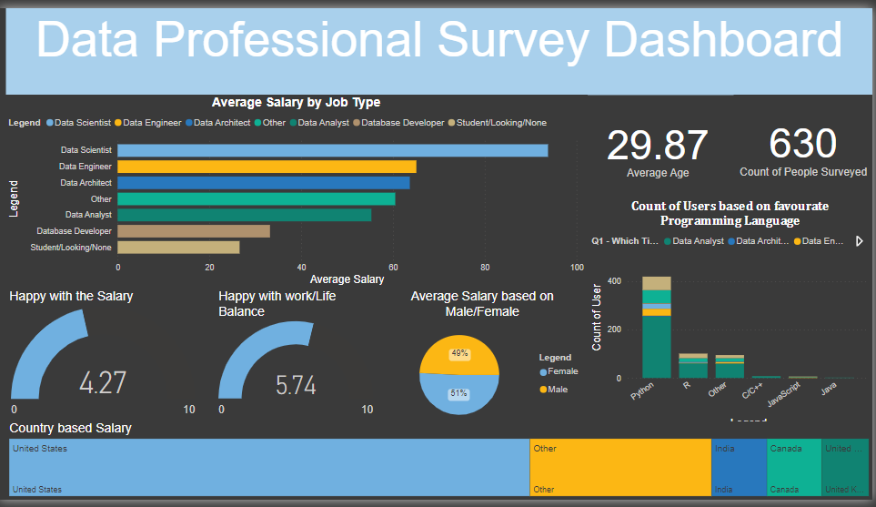

# Data-Jobs-Dashboard

I have used a dataset that is raw and totally untouched. Signifies that there are a lot of cleaning as well as manipulation is needed to visualize it. 

The Columns in the Dataset are:

* Unique ID	Email	
* Date Taken (America/New_York)	
* Time Taken (America/New_York)	
* Browser	
* OS	
* City	
* Country	
* Referrer	
* Time Spent	
* Q1 - Which Title Best Fits your Current Role?	
* Q2 - Did you switch careers into Data?	
* Q3 - Current Yearly Salary (in USD)	
* Q4 - What Industry do you work in?	
* Q5 - Favorite Programming Language	
* Q6 - How Happy are you in your Current Position with the following? (Salary)	
* Q6 - How Happy are you in your Current Position with the following? (Work/Life Balance)	
* Q6 - How Happy are you in your Current Position with the following? (Coworkers)	
* Q6 - How Happy are you in your Current Position with the following? (Management)	
* Q6 - How Happy are you in your Current Position with the following? (Upward Mobility)	
* Q6 - How Happy are you in your Current Position with the following? (Learning New Things)	
* Q7 - How difficult was it for you to break into Data?	
* Q8 - If you were to look for a new job today, what would be the most important thing to you?	
* Q9 - Male/Female?	
* Q10 - Current Age	
* Q11 - Which Country do you live in?	
* Q12 - Highest Level of Education	
* Q13 - Ethnicity

Steps for Data Cleaning:

1. After observing the Data, Columns such as 'Browser','OS','City','Country','Referrer' are removed because of no use due to blank/useless values. 
2. Furthermore, 'Q1 - Which Title Best Fits your Current Role?' column has a lot of values specified in Other Category. Thus, separating values using delimiters such as paranthesis. Delete the rest extra information column.
3. Need to repeate same step 2 from few other columns such as: 'Q4 - What Industry do you work in?', 'Q5 - Favorite Programming Language', 'Q11 - Which Country do you live in?'. Separate the extra information from the columns and then delete it as of now.
4. Considering the Ideology to work on a salary rather then range, which is provided to us. Therefore, seperated the initial number by using 'Digit and Non-Digit' separator. Here, we will have lower limit and then replace values such as 'k', '-' with space. Finally, Column seems sorted but in the same column there are two rows having value as '+'. Thus we need to replace those with the adjacent values. Next, take average of both and delete the rest.

After these all Data Cleaning and Manipualtion Operations, Data is ready to visualize.

I have used variety of charts to portrey the comparision and the value changes by selecting the countries.
Below is an Image of Dashboard:
  